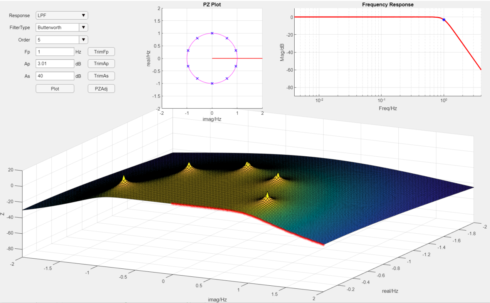
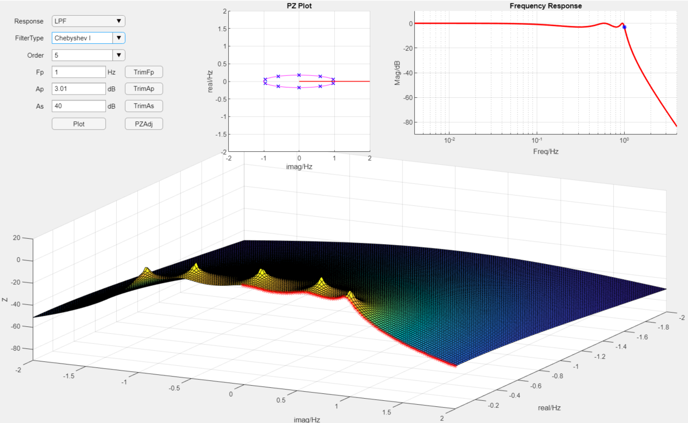
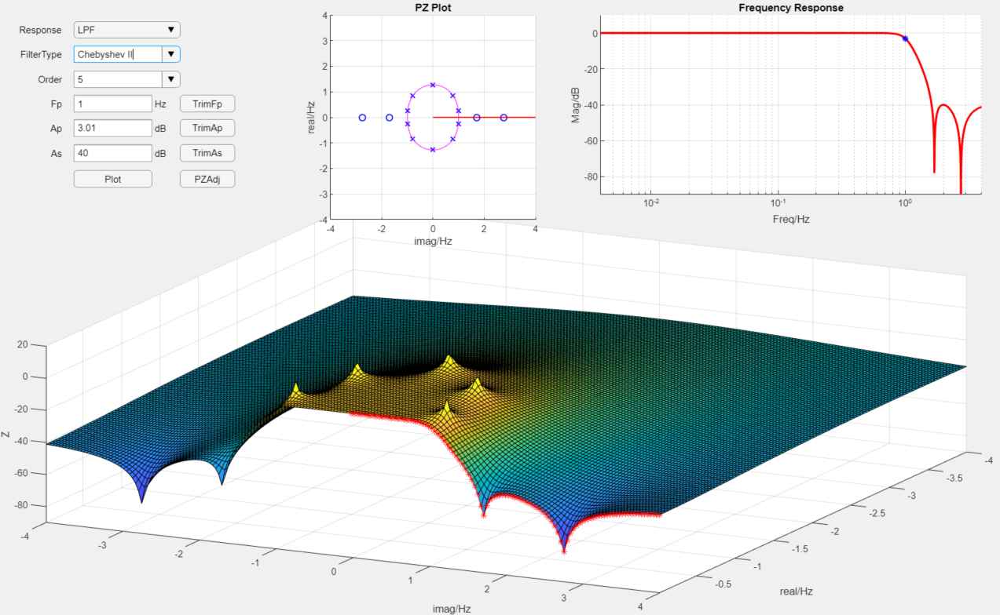
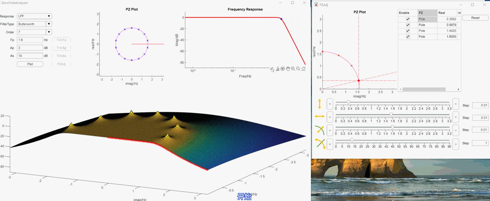

# 滤波器零极点分析工具
> 这是一个Matlab版本滤波器分析工具，目的是为了更加直观的理解零极点对滤波器频率响应的影响，更多可以关注微信公众号"[电路设计小工具](https://mp.weixin.qq.com/s/fxfEnir-hU0YvF9_CWyI6g)".

### 如何使用(how to use)
下载整个文件包，双击ZeroPoleApp.mlapp运行即可。

### 运行环境(Env)
win10, Matlab2021a

### 程序结构

更多技术细节可以参考$^{[1][2][3][4][5][6]}$

### 特性
基于Matlab的appdesign工具开发滤波器零极点分析App，主要特点是：
- 支持切比雪夫滤波器(Chebyshev I)和逆切比雪夫滤波器(Chebyshev II, Inverse Chebyshev)零极点分析探索和设计
- 可以动态调整滤波器参数
- 可以动态调整零极点参数

### 运行效果(demo)

#### 不同滤波器类型零极点分布情况
Butterworth滤波器：

Chebyshev I滤波器：

Chebyshev II滤波器：

视频录制：
视频讲解滤波器零极点分析和探索工具的使用。
0，背景介绍
> 在开发模拟无源滤波器设计软件过程中发现滤波器设计从频率响应到滤波器参数之间由一个零极点作为中间媒介，为了揭开零极点和频率响应的关系，故开发了本套滤波器零极点分析工具探索其中的秘密。

1，工具作用介绍
> 当然若用本工具用来设计系统频率响应设计也是可以的，本工具主要作用在于探索，所以其中的玩法由你决定。

2，大体界面介绍工具
> 本软件由Matlab的App Designer开发，运行在Matlab 2021a中，主要分为五个区域，第一是滤波器参数输入界面，可以用来设置滤波器的基本参数，如滤波器类型，阶数，截止频率，纹波，阻带衰减；第二是零极点平面图，可以展示当前滤波器设置下的滤波器零极点平面图，极点用叉便是，零点用圈表示，横坐标是虚部，纵坐标是实部，第三是频率响应图，横坐标是频率，纵坐标是dB为单位的幅度值，第四是零极点三维图，3个轴分别为虚轴、实轴、幅度，最后是参数调整按钮区，这些按钮可以调出操作界面，可以实现参数的动态调整。

3，动态调整滤波器参数介绍
> 调整滤波器参数演示，特别是逆切比雪夫和偶数阶切比雪夫的演示

4，动态调整零极点参数
> 演示巴特沃斯滤波器的极点位置发生变化时的滤波器频率响应曲线的变化，动态修改调整极点位置查看纹波的变化。

程序的Matalb源码已经上传GitHub中$^{[7]}$(https://github.com/etools361/MatlabChebyshevFilterDesignApp)，有兴趣的同学可以下载试用体验，当然也欢迎技术交流。

### 参考(ref)
[1] : [模拟无源滤波器设计（一）-滤波器历史](https://mp.weixin.qq.com/s/wNRHyBHpimjU90bymHp7JA) \
[2] : [模拟无源滤波器设计（二）-梯形网络综合](https://mp.weixin.qq.com/s/3GMQs4WDm683tdAXqyoOgQ) \
[3] : [模拟无源滤波器设计（三）-梯形网络仿真](https://mp.weixin.qq.com/s/nZFx7weLcO-WRKLbP0T4jQ) \
[4] : [模拟无源滤波器设计（四）-通用无源网络仿真](https://mp.weixin.qq.com/s/mllwGShvbh3TWdFRbp9LhQ) \
[5] : [模拟无源滤波器设计（五）-Butterworth滤波器设计详解](https://mp.weixin.qq.com/s/pIMPIh8ize49mxXG4SHT_w) \
[6] : [模拟无源滤波器设计（六）-Chebyshev滤波器设计详解](https://mp.weixin.qq.com/s/6b1HF81X93M9D4yfIAFROw) \
[7] : [欢迎关注电路设计小工具公众号](https://mp.weixin.qq.com/s/fxfEnir-hU0YvF9_CWyI6g) \
[8] : [Matlab源码地址](https://github.com/etools361/MatlabChebyshevFilterDesignApp)
